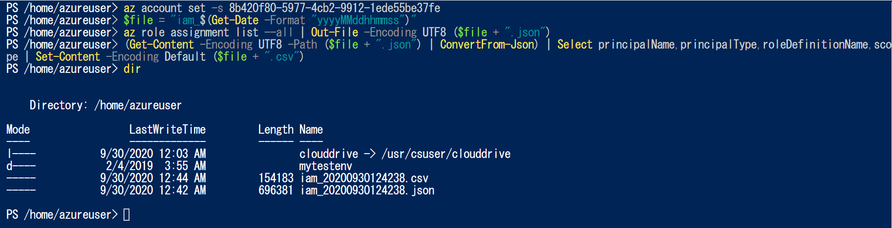
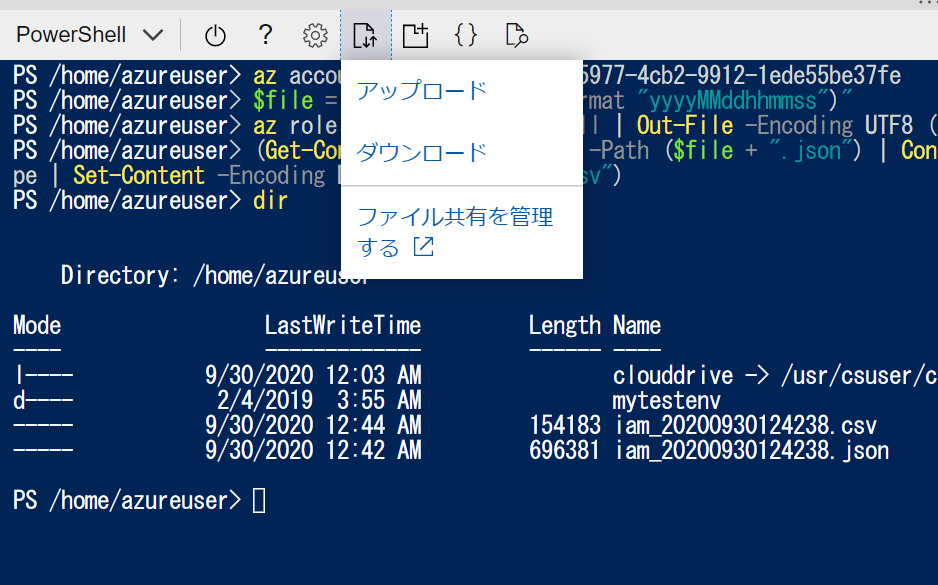

# What's this?
Outputs the IAM setting status under the Azure subscription.
Since the procedure is based on Azure Cloudshell, it is not necessary to prepare a local environment for execution. 


<br />
<br />
<br />

# How to
execute below on cloud shell on powershell  

## 1. Set Subscription
```az account set -s {YOUR_SUBSCRIPTION_ID}```
<br />
<br />
## 2. Set Filename
```$file = “iam_$(Get-Date -Format “yyyyMMddhhmmss”)”```
<br />
<br />
## 3. Output IAM settings under subscription
```az role assignment list –all | Out-File -Encoding UTF8 ($file + “.json”)```
<br />
<br />
## 4. Convert Json to Csv
```(Get-Content -Encoding UTF8 -Path ($file + “.json”) | ConvertFrom-Json) | Select principalName,principalType,roleDefinitionName,scope | Set-Content -Encoding Default ($file + “.csv”)```

 so far is as follows

<br />
<br />
## 5. Download CSV

<br />
<br />
## 6. Remove files
After completing the DL, delete the used file.  
```rm ($file + “*”)```
